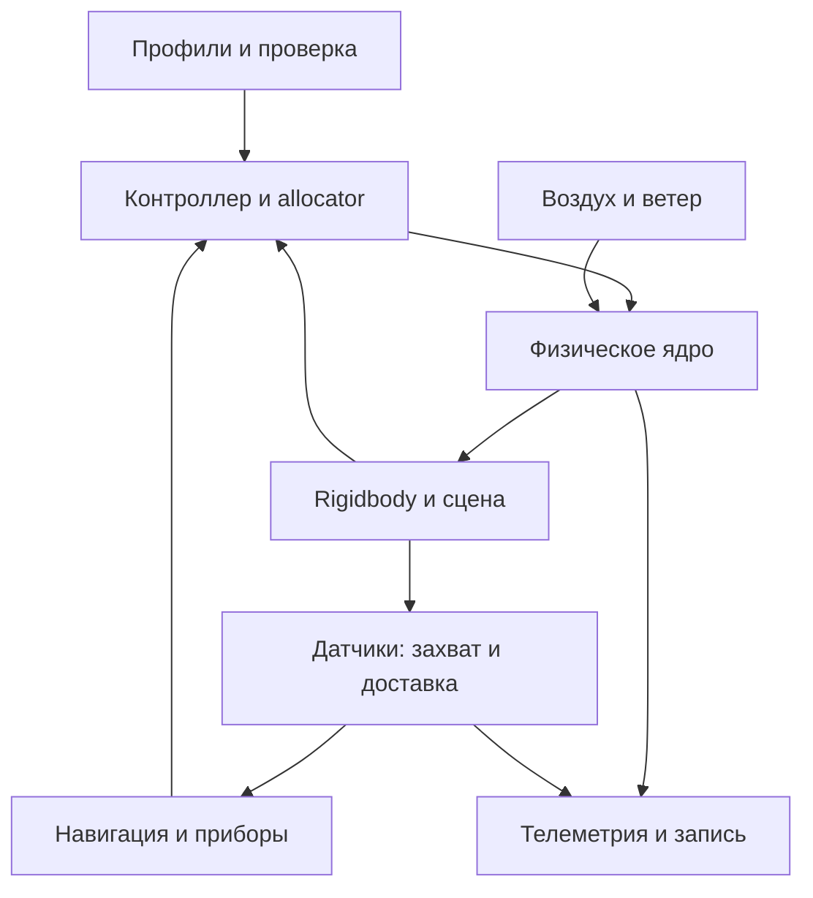

# Архитектура и технические решения

[Документация](README.md) · [Разработка](DEVELOPMENT.md)

## Разделение ответственности

| Слой | Ответственность | Где находится |
|---|---|---|
| Профили и контракт | Параметры аппарата и среды, версии, валидация | `DronePhysics/Core`, генератор контракта |
| Физическое ядро | Характеристики роторов, воздух, сопротивление, привод, энергия, тепло | `Assets/DronePhysics/Core` |
| Unity-адаптер | Состояние тела, преобразование координат, приложение сил, контакт | `Assets/DronePhysics/Unity` |
| Управление | Команды пилота, PID, allocator, удержание и маршрутные цели | Demo Runtime и полётная интеграция |
| Оборудование | Захват, ошибки, задержка и доставка измерений | `Assets/DroneSensors/Core` и адаптеры |
| Приложение | Каталоги, редакторы, запуск, камеры, графики и запись | `Assets/DroneUI` |
| Среда | Физические источники и согласование с визуальной сценой | `Assets/DroneEnvironment` |

## Путь данных в полёте

Контроллер задаёт команды роторов. Ядро рассчитывает силы и моменты, Unity интегрирует тело и контакт. Навигация получает GPS-измерения; ориентация и высота пока берутся из физического состояния. Это различие важно при исследованиях отказов и шумов.

## Решения, определяющие поведение

### Один физический источник

Воздух передаётся через `IAirProvider`, ветер — через `IWindProvider`. На шаге применяется согласованное состояние среды. Визуальное окружение получает отображаемое состояние; оно не добавляет второй независимый набор аэродинамических сил. Ручной ветер подменяет действующий источник и учитывает флаг `windInteraction`.

### Геометрия рассчитывается до полёта

Треугольники загруженной модели преобразуются в метры и физические оси корня. Снимок mesh берётся на главном потоке Unity, растеризация силуэтов выполняется фоново. В профиль сохраняется таблица площадей; во время полёта повторная растеризация не нужна. Устаревший результат после смены модели отбрасывается.

Визуальный дочерний объект можно масштабировать и вращать, физический корень остаётся с масштабом 1. Рабочую массу и инерцию задаёт профиль, а столкновения используют упрощённую геометрию.

### Строгий профиль и документ редактора

`profile.json` содержит принятый физический контракт. `document.json` хранит сведения редактора, категории, статус и визуальные настройки; `asset-bindings.json` связывает части модели с роторами. Черновик допускает незавершённое редактирование, но для запуска требуется валидный физический профиль.

Такое разделение позволяет переносить модель и редакторские данные без добавления случайных UI-полей в строгую физическую схему.

### Маршрут задаёт цели контроллеру

Планировщик хранит точки и состояние миссии. Внешний горизонтальный контур формирует наклон, далее работают существующие PID и allocator. Движение выполняется силами роторов. Потеря GPS прекращает горизонтальную навигацию, автоматического возобновления нет.

### Измерение имеет два времени

Датчик сначала захватывает физический эталон, затем доставляет измерение с заданной задержкой. График ошибки сопоставляет измерение с эталоном времени захвата. Недоступность измерения не заменяется вымышленным значением; пропуски видны в анализе и записи.

### Ввод принадлежит одному действию

В F3/F4 поле получает клавиатуру только после явного щелчка. Пока пользователь вводит число, полётные команды не обрабатываются. Освобождение поля возвращает управление. В F5 движение клавиатуры относится к свободной камере.

## Контракт и поставка

Источник JSON-контракта — один Python-генератор, из которого создаются DTO, схемы и реестр параметров. UPM-пакеты экспортируются из исходников с проверкой хешей; документация пакета также является производным файлом.

Версии физического SDK, JSON и CSV относятся к разным интерфейсам. Условия совместимости и способы подключения приведены в [Physics/DEVELOPMENT.md](Physics/DEVELOPMENT.md), структура записи — в [EXPORT_AND_ANALYSIS.md](EXPORT_AND_ANALYSIS.md).
